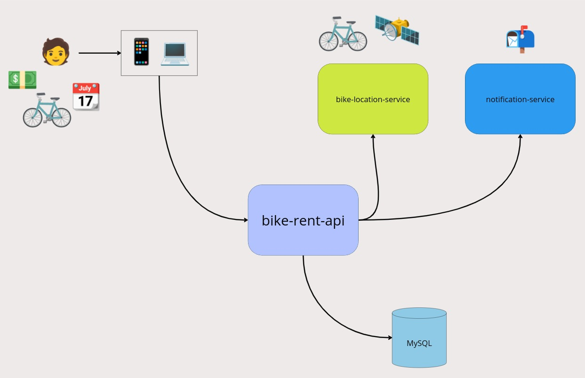

# Technical Design Document

## 1. Introduction
The Bike Rental API is designed to facilitate bike rentals, providing endpoints for managing bikes, bike rentals, and user registration. This document outlines the technical aspects and design considerations of the system.

## 2. System Architecture
The system follows a typical MVC (Model-View-Controller) architecture. It is designed to be modular, with distinct modules for handling bikes, bike rentals, and user-related operations.

## 3. Technology Stack
- **Programming Languages:** Java 17
- **Framework:** Spring Boot
- **Database:** MySQL
- **Testing:** JUnit, Mockito
- **Serialization:** JSON (Jackson)

## 4. Database Design
- The database schema includes tables for bikes, bike rentals, and users.
- Relationships are established between relevant tables, ensuring data integrity.

## 5. Module Design

### 5.1. Bike Module
- **Responsibilities:**
    - Provide APIs for managing bikes.
    - Validate and process bike-related operations.
- **Key Components:**
    - BikeController: Handles incoming requests related to bikes.
    - BikeService: Contains business logic for bike-related operations.
    - BikeRepository: Manages database interactions for bikes.

### 5.2. Bike Rental Module
- **Responsibilities:**
    - Handle bike rental operations.
    - Calculate rental fees and manage rental periods.
- **Key Components:**
    - BikeRentalController: Exposes endpoints for bike rentals.
    - BikeRentalService: Implements business logic for bike rental operations.
    - BikeRentalRepository: Manages database interactions for bike rentals.

### 5.3. User Module
- **Responsibilities:**
    - Manage user registration and authentication.
    - Provide user-related information.
- **Key Components:**
    - UserController: Handles user-related requests.
    - UserService: Manages user-related business logic.
    - UserRepository: Handles user data storage and retrieval.

### 5.4. Controller Layer
- Controllers are responsible for handling incoming requests, validating input, and invoking the appropriate service methods.
- Controllers communicate with the service layer to perform business logic.

### 5.5. Service Layer
- Contains the business logic for the application.
- Service methods are responsible for coordinating actions between the controllers and repositories.

### 5.6. Repository Layer
- Manages data access to the underlying database.
- Repositories interact with the database to perform CRUD operations.

## 6. Security
- **Authentication:** Utilizes Spring Security for user authentication.
- **Authorization:** Role-based access control ensures users have the necessary permissions.

## 7. Error Handling
- Centralized error handling using Spring MVC's exception handling.
- Well-defined error responses with appropriate HTTP status codes and error messages.

## 8. Testing Strategy
- **Unit Testing:** JUnit for testing individual units of code.
- **Integration Testing:** Ensures components work together correctly.
- **End-to-End Testing:** Verifies the entire application's functionality.

## 9. Performance Considerations
- **Caching:** Implement caching strategies, where applicable.
- **Load Balancing:** Consider load balancing mechanisms for improved performance.

## 10. Deployment
- Deployable as a standalone Spring Boot application.
- CI/CD pipeline for automated testing and deployment.

## 11. Maintenance and Scalability
- Codebase follows best practices for maintainability.
- Scalability considerations include database optimization and load balancing.

## 12. Trade-offs and Decisions
- **Spring Framework:** Chosen for its ease of development and integration capabilities.
- **Database Choice:** Choosing a relational database is driven by structured data needs, requiring data integrity and consistency.

## 13. Conclusion
- The technical design for the Bike Rental API adopts a robust and modular architecture. Leveraging the Spring Boot framework facilitates efficient backend development, while the choice of a relational database ensures structured and organized data management. The API follows RESTful principles for communication, promoting interoperability. 
- Overall, the design prioritizes scalability, maintainability, and a solid foundation for future enhancements, making it well-suited for the effective management of bike rental operations.

## 14. Project Structure Analysis

### 14.1. Strengths
- Clear separation of concerns with well-defined modules.
- Effective use of Spring annotations for MVC and dependency injection.
- Comprehensive testing strategy with a focus on unit and integration testing.
- Utilization of Mockito for mock testing.
# Future Enhancements
- Should use Spring Security to handle the authentication using OAUTH2 with Json Web Token.
- Integration with external payment gateways for handling bike rental payments.
- Mobile application development for a user-friendly rental experience.
- Indexing is should be applied to optimize query performance.
- Improve API documentation using tools like Swagger.

---

Note: Replace `<Your Database Choice>` and `<URL to Architecture Diagram>` with actual information and links. This technical design is a generalized template; adjust it according to the specific details of your project.